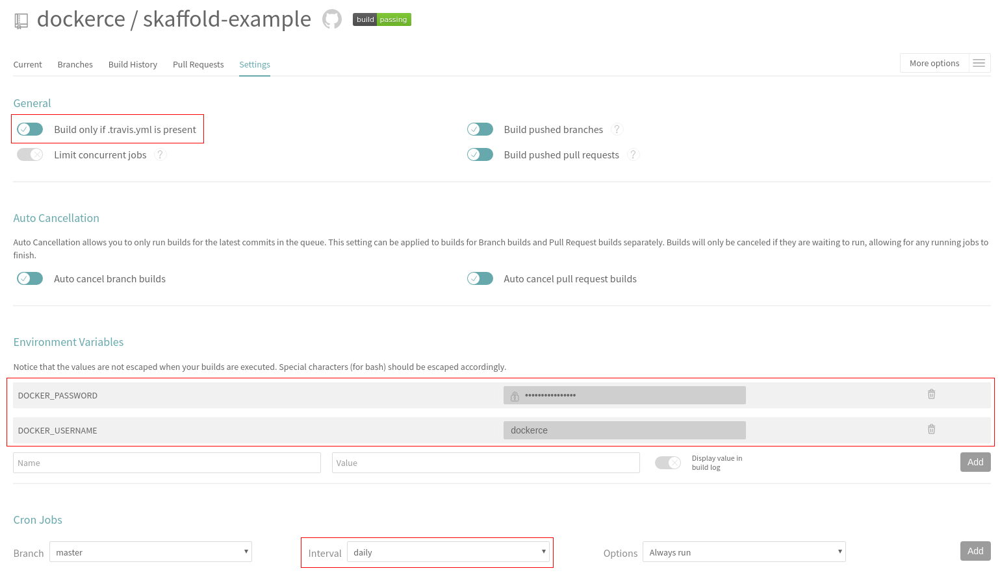

# Skaffold Example Image

[Skaffold](https://github.com/GoogleContainerTools/skaffold) is a command line tool that facilitates continuous development for Kubernetes applications.

## Travis settings

